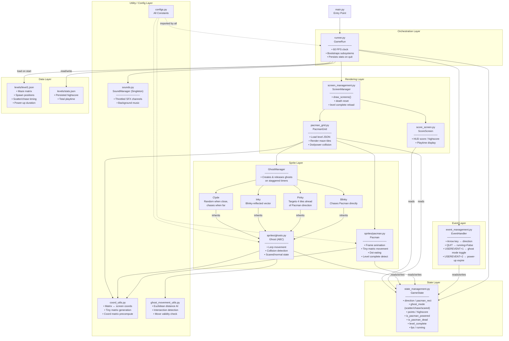
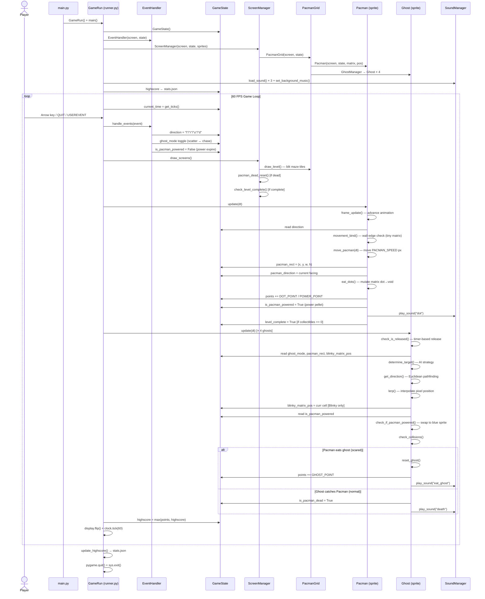
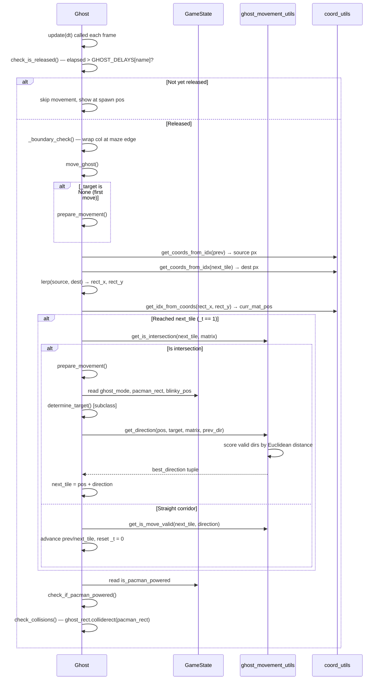

# PyPacman — Technical Architecture Documentation

---

## Table of Contents

- [1. Project Overview](#1-project-overview)
  - [1.1 Technology Stack](#11-technology-stack)
  - [1.2 Key Design Principles](#12-key-design-principles)
  - [1.3 Directory Structure](#13-directory-structure)
  - [1.4 Game Constants at a Glance](#14-game-constants-at-a-glance)
- [2. System Architecture](#2-system-architecture)
  - [2.1 Subsystem Map](#21-subsystem-map)
  - [2.2 Architecture Flowchart](#22-architecture-flowchart)
  - [2.3 Subsystem Descriptions](#23-subsystem-descriptions)
    - [Entry & Orchestration](#entry--orchestration)
    - [State Management](#state-management)
    - [Event Management](#event-management)
    - [Rendering](#rendering)
    - [Sprites](#sprites)
    - [Utilities & Audio](#utilities--audio)
    - [Level Data](#level-data)
- [3. Data Flow](#3-data-flow)
  - [3.1 Main Loop Sequence](#31-main-loop-sequence)
  - [3.2 Ghost AI Decision Flow](#32-ghost-ai-decision-flow)
  - [3.3 Key Data Flows Explained](#33-key-data-flows-explained)

---

## 1. Project Overview

PyPacman is a faithful Pac-Man clone built with **Python** and **pygame-ce** (community edition). It follows the classic arcade game loop pattern — a fixed-timestep loop running at 60 FPS — with a centralized, shared game state object decoupling all subsystems from one another.

The game supports a single level that repeats infinitely; there is no game-over screen. On death or level completion the stage resets in place, preserving the running score. Highscores and total playtime are persisted to disk across sessions.

### 1.1 Technology Stack

| Layer | Technology |
|---|---|
| Language | Python 3.12+ |
| Game engine | pygame-ce 2.5.6 |
| Data persistence | JSON (`levels/stats.json`) |
| Audio | pygame.mixer (WAV/MP3) |
| Logging | stdlib `logging` via `src/log_handle.py` |

### 1.2 Key Design Principles

- **Centralized state** — `GameState` is the single source of truth. All subsystems read from and write to it; no subsystem holds authoritative state of its own.
- **Event-driven timers** — Ghost mode switching and power-up expiration are driven by `pygame.USEREVENT` timers, not by polling elapsed time inside subsystems.
- **Tiny-matrix collision** — Each 20×20-pixel grid cell is sub-divided into a 5×5 grid (100 sub-cells per logical cell) to enable smooth, per-pixel movement with wall collision without a physics engine.
- **Lerp movement for ghosts** — Ghosts interpolate between discrete matrix cells each frame using linear interpolation, giving smooth motion decoupled from grid snapping.
- **Singleton SoundManager** — Audio is accessed globally through a Python singleton; any module can call `SoundManager()` without needing a reference passed in.

### 1.3 Directory Structure

```
PyPacman/
├── main.py                         # Entry point
├── requirements.txt
├── levels/
│   ├── level1.json                 # Maze matrix, spawn positions, timing
│   └── stats.json                  # Persisted highscore & playtime
├── assets/
│   ├── sounds/                     # WAV / MP3 audio files
│   └── sprites/                    # Sprite sheet PNGs
└── src/
    ├── configs.py                  # All game constants
    ├── sounds.py                   # SoundManager singleton
    ├── log_handle.py               # Logger factory
    ├── runner.py                   # GameRun — main loop orchestrator
    ├── game/
    │   ├── state_management.py     # GameState — central data container
    │   └── event_management.py     # EventHandler — pygame event dispatch
    ├── gui/
    │   ├── screen_management.py    # ScreenManager — frame coordinator
    │   ├── pacman_grid.py          # PacmanGrid — maze renderer & collision
    │   ├── score_screen.py         # HUD score display
    │   └── loading_screen.py       # Loading animation
    ├── sprites/
    │   ├── pacman.py               # Pacman sprite & movement
    │   ├── ghosts.py               # Ghost base class, AI subclasses, GhostManager
    │   └── sprite_configs.py       # Sprite asset paths
    └── utils/
        ├── coord_utils.py          # Matrix ↔ screen coordinate conversion
        ├── ghost_movement_utils.py # Euclidean pathfinding for ghost AI
        ├── draw_utils.py           # Drawing helpers
        └── graph_utils.py          # Graph utilities
```

### 1.4 Game Constants at a Glance

| Constant | Value | Purpose |
|---|---|---|
| `SCREEN_WIDTH / HEIGHT` | 1024 × 768 px | Window dimensions |
| `CELL_SIZE` | 20 × 20 px | One maze tile |
| `NUM_ROWS / COLS` | 31 × 28 | Maze grid dimensions |
| `PACMAN_SPEED` | 4 px/frame | Pacman movement & tiny-matrix subdivision |
| `GHOST_SPEED_FAST` | 5 | Ghost normal speed scalar |
| `GHOST_SPEED_SLOW` | 2 | Ghost scared speed scalar |
| `DOT_POINT` | 10 | Score per dot |
| `POWER_POINT` | 15 | Score per power pellet |
| `GHOST_POINT` | 25 | Score per eaten ghost |
| `LEVEL_COMP_POINT` | 80 | Bonus on level clear |

---

## 2. System Architecture

### 2.1 Subsystem Map

| Subsystem | Module | Role |
|---|---|---|
| Orchestrator | `runner.py` / `main.py` | Owns the 60 FPS loop, bootstraps all systems |
| State | `game/state_management.py` | Shared mutable data store (GameState) |
| Events | `game/event_management.py` | pygame event dispatch, key bindings, timer events |
| Screen | `gui/screen_management.py` | Frame coordination, death/level-reset routing |
| Grid | `gui/pacman_grid.py` | Maze tile rendering, dot/power-up collision |
| Pacman | `sprites/pacman.py` | Sprite animation, tiny-matrix movement, dot eating |
| Ghosts | `sprites/ghosts.py` | AI targeting (Blinky/Pinky/Inky/Clyde), lerp movement |
| Audio | `sounds.py` | Singleton mixer, throttled SFX, background music |
| Utils | `utils/` | Coordinate math, pathfinding, drawing helpers |
| Config | `configs.py` | All constants (no magic numbers in game code) |
| Data | `levels/` | Level JSON matrix, persisted stats |

### 2.2 Architecture Flowchart



### 2.3 Subsystem Descriptions

#### Entry & Orchestration

`main.py` instantiates `GameRun` and calls `main()`. `GameRun` owns the entire application lifetime:

1. Initializes pygame and creates the display surface (`1024×768`).
2. Constructs `GameState`, `EventHandler`, and `ScreenManager` in dependency order.
3. Creates the ghost-mode USEREVENT timer (`USEREVENT+1`).
4. Loads sounds into `SoundManager`.
5. Reads persisted highscore/playtime from `levels/stats.json`.
6. Runs the 60 FPS loop until `game_state.running` is `False`.
7. Writes updated stats to disk and exits cleanly.

#### State Management

`GameState` (`src/game/state_management.py`) is a plain Python class with property-guarded attributes. It contains no logic — only validated data. Every other subsystem receives a reference to the same instance, making it the system bus.

Key state categories:

| Category | Fields |
|---|---|
| Control flow | `running`, `fps`, `level`, `level_complete`, `is_pacman_dead` |
| Input | `direction` (`l`/`r`/`u`/`d`/`""`) |
| Spatial | `pacman_rect`, `ghost_pos{}`, `blinky_matrix_pos`, `pacman_direction` |
| Ghost AI | `ghost_mode` (`scatter`/`chase`/`scared`), `custom_event`, `mode_change_events` |
| Power-up | `is_pacman_powered`, `power_up_event`, `power_event_trigger_time`, `scared_time` |
| Scoring | `points`, `highscore`, `mins_played` |

#### Event Management

`EventHandler` processes the pygame event queue each frame:

- `QUIT` → sets `running = False`
- `KEYDOWN` arrow keys → writes `direction` to `GameState`
- `USEREVENT+1` → toggles `ghost_mode` between `scatter` and `chase`; re-arms the timer with the next interval from `mode_change_events`
- `USEREVENT+2` → sets `is_pacman_powered = False` when the power-up duration expires

#### Rendering

`ScreenManager` coordinates one full frame:

1. `PacmanGrid.draw_level()` — renders all maze tiles (wall, dot, power, void) from the in-memory matrix.
2. `pacman_dead_reset()` — if `is_pacman_dead`, clears all sprites and rebuilds the stage.
3. `ScoreScreen.draw_scores()` — blits HUD (score, highscore, playtime) to the screen.
4. `check_level_complete()` — if `level_complete`, waits 2 s then fully reloads `PacmanGrid`.

`PacmanGrid` loads `level1.json`, constructs the `Pacman` sprite and `GhostManager`, and handles dot/power collision by mutating the matrix (`"dot"` → `"void"`).

#### Sprites

**Pacman** (`sprites/pacman.py`):

- Loads four directional animation frame sets from sprite sheets.
- Maintains a *tiny matrix* — a `5×` sub-division of the level matrix — to check wall edges at sub-cell resolution before each move.
- Each frame: updates animation, reads `direction` from state, validates wall edges, moves `PACMAN_SPEED` pixels, checks dots, and flags `level_complete` when `collectibles == 0`.
- Power-up collection fires `USEREVENT+2` via `set_timer`.

**Ghost** base class (`sprites/ghosts.py`):

- Each ghost interpolates (`lerp`) between discrete matrix cells each frame using a `_t` parameter (`0.0 → 1.0`).
- At intersections or when reaching a cell boundary, `prepare_movement()` calls `determine_target()` (abstract) then `get_direction()` (Euclidean pathfinding) to pick the best valid direction.
- Scared ghosts use `get_random_target()` and their image switches to the blue sprite.
- Collision with Pacman: if scared → ghost resets + score; if normal → Pacman death.

| Ghost | Chase Strategy |
|---|---|
| Blinky | Directly targets Pacman's current cell |
| Pinky | Targets 4 tiles ahead of Pacman's facing direction |
| Inky | Reflects Blinky's position vector through 2 tiles ahead of Pacman |
| Clyde | Chases Pacman when far (>8 tiles Manhattan), random target when close |

**GhostManager** creates all four ghosts with staggered release delays (Blinky: 4 s, Pinky: 8 s, Inky: 12 s, Clyde: 16 s).

#### Utilities & Audio

- **`coord_utils.py`** — bidirectional conversion between `(row, col)` matrix indices and `(x, y)` screen pixels; generates the tiny collision matrix; precomputes a coordinate lookup table for the tiny matrix.
- **`ghost_movement_utils.py`** — `get_direction()` uses Euclidean distance to score all valid moves from a ghost's position toward its target, respecting walls and the reverse-direction prohibition. `get_is_intersection()` detects cells with more than one available exit.
- **`SoundManager`** — Python singleton using `__new__`. Throttles sounds via a per-sound `freq` (minimum ms between plays) to prevent overlap. Manages 64 mixer channels.

#### Level Data

`levels/level1.json` defines:

- `matrix` — a 31×28 grid of cell type strings: `wall`, `dot`, `power`, `void`, `spoint`, `elec`
- `pacman_pos` / `ghost_pos` — spawn coordinates in matrix indices
- `mode_intervals` — list of scatter/chase durations in seconds
- `scared_time` — power-up duration in ms (default: 8000)
- `grid_start` — pixel offset of the maze top-left corner within the window

`levels/stats.json` persists `highscore` (integer) and `mins_played` (float), written on every clean exit.

---

## 3. Data Flow

### 3.1 Main Loop Sequence



### 3.2 Ghost AI Decision Flow



### 3.3 Key Data Flows Explained

**Player input → Pacman movement:**
`KEYDOWN` → `EventHandler.key_bindings()` → `GameState.direction` → `Pacman.movement_bind()` (validates tiny-matrix wall edges) → `Pacman.move_pacman()` (moves `PACMAN_SPEED` pixels) → `GameState.pacman_rect` (broadcast to ghost AI).

**Power pellet activation:**
`Pacman.eat_dots()` mutates matrix cell to `"void"` → calls `create_power_up_event()` → `pygame.set_timer(USEREVENT+2, scared_time)` → `GameState.is_pacman_powered = True` → each ghost's `check_if_pacman_powered()` detects the flag, swaps to blue sprite, and calls `make_ghost_scared()` (reverses direction, sets random targeting) → `USEREVENT+2` fires after `scared_time` ms → `EventHandler` sets `is_pacman_powered = False` → ghosts revert to normal image and AI on next `check_if_pacman_powered()`.

**Ghost mode cycling (scatter ↔ chase):**
`GameRun.create_ghost_mode_event()` arms `USEREVENT+1` with the first interval from `mode_change_events` → fires → `EventHandler` toggles `GameState.ghost_mode` and re-arms the timer with the *next* interval (consumed via a stateful index in `GameState`) → ghost `determine_target()` reads `ghost_mode` each time it selects a target.

**Death and reset:**
Ghost `check_collisions()` sets `GameState.is_pacman_dead = True` → `ScreenManager.pacman_dead_reset()` detects flag next frame → clears sprite group → calls `PacmanGrid.reset_stage()` (rebuilds sprites from the original matrix) → re-adds all sprites → clears `is_pacman_dead`. Score is preserved.

**Level completion:**
`Pacman.update()` detects `collectibles == 0` → sets `GameState.level_complete = True` → `ScreenManager.check_level_complete()` waits 2 s → fully re-instantiates `PacmanGrid` (reloading the JSON matrix) → resets all sprites. Score is preserved; level counter increments.
